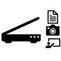

#  AI Skills for Windows

## Summary

Implementing and integrating efficient AI and Computer Vision (CV) solutions is a hard task for developers. The industry is moving at a fast pace and the amount of custom-tailored solutions coming out makes it almost impossible for app developers to keep up easily. We preview a base framework to expose AI solutions called *AI Skills for Windows* as well as pre-built common solutions (i.e. detection, classification, segmentation, etc.) developed by [Microsoft](*MicrosoftSkills) and [partners](#IntelSkills).

The *AI Skills for Windows* framework is meant to standardize the way AI and CV is put to use within a Windows application (i.e.: UWP, Desktop Win32, .Net Core 3.0+) running on the edge. It aims to abstract away the complexity of AI techniques by simply defining the concept of *skills* which are modular pieces of code that process input(s) and produce output(s). The implementation that contains the complex details (i.e. pre and post processing of data, model inference, algorithm, transcoding, applying the right heuristics, etc.) is encapsulated by WinRT APIs that inherits the base class present in the [Microsoft.AI.Skills.SkillInterface](./doc/Microsoft.AI.Skills.SkillInterface.md) namespace, which leverages built-in Windows primitives which in-turn eases interop with built-in hardware acceleration leveraged by frameworks such as *[Windows ML](https://docs.microsoft.com/en-us/windows/ai/windows-ml/)*. All *AI Skills for Windows* derivatives follow the same programatic paradigm and flow from a developer consumer standpoint: if you understand [how to use one *AI Skill for Windows*](./doc/important-api-concepts.md), you understand how to use them all. ([*See key AI Skills API concepts*](./doc/important-api-concepts.md))

While this release focuses on vision-oriented scenarios and primitives, this API is meant to accommodate any kind of input and output variable and a wide range of scenarios (Vision, Audio, Text, etc.). Any developer can extend this API set and expose their own AI skills. [See skills released by Intel](#IntelSkills)

If you are looking for the earlier preview release samples and documentation, we archived them in a branch here: *[Preview branch](https://github.com/microsoft/AISkillsForWindows/tree/Preview)*

## Creating your own *AI Skill for Windows* to empower others

For a guide on how to use the *AI Skills for Windows* interfaces to author a new *AI Skill for Windows* of your own exposing your AI solution to other Windows app developers, and creating an actual app to consume this crafted skill, see this complete end-to-end sample:

### **[Sentiment Analyzer Sample Skill](samples/SentimentAnalyzerCustomSkill)**

| ____________ | Walking through the steps to create, in C++ or in C#, a sample *AI Skill for Windows* that leverages the Windows [FaceDetector](https://docs.microsoft.com/en-us/uwp/api/Windows.Media.FaceAnalysis.FaceDetector) to extract sub-images of face area and [Windows ML](https://docs.microsoft.com/en-us/windows/ai/windows-ml/) to run inference with a sentiment classifier model that takes images as inputs and returns predictions. Theres are also examples of Win32, .Net Core 3.0 and UWP applications that ingest this *AI Skill for Windows* and use MediaFoundation APIs to feed it with frames from a camera or file. |
| -- | -- |

## Code samples for using *AI skills for Windows* [published by Microsoft on nuget.org](https://www.nuget.org/profiles/VisionSkills) 

### **[Object Detector](samples/ObjectDetector)**

|  | Detecting and classifying objects in images |
| -- | -- |

### **[Object Tracker](samples/ObjectTracker)**

|  | Tracking objects in videos |
| -- | -- |

### **[Skeletal Detector](samples/SkeletalDetector)**

|  | Estimating poses of people in images |
| -- | -- |

### **[Concept Tagger](samples/ConceptTagger)**

|  | Obtaining classification scores of concepts in images |
| -- | -- |

### **[Image Scanning](samples/ImageScanning)**

|  | A set of AI skills to achieve content scanning scenarios such as the ones featured in *OfficeLens* |
| -- | -- |
| **[CurvedEdgesDetector](./samples/ImageScanning/README.md#CurvedEdgesDetectorExample)** | Seeks within an image the pixels that constitute the curved edges composing the contour of a given quad and returns their coordinates. |
| **[ImageCleaner](./samples/ImageScanning/README.md#ImageCleanerExample)** | Cleans and enhances an image given a specified preset. |
| **[ImageRectifier](./samples/ImageScanning/README.md#ImageRectifierExample)** | Rectifies and crops an image to a rectangle plane given four UV coordinates. |
| **[LiveQuadDetector](./samples/ImageScanning/README.md#QuadDetectorExample)** and **[QuadDetector](./samples/ImageScanning/README.md#QuadDetectorExample)** | Searches an image for quadrilateral shapes and returns the coordinates of their corners if found. The *LiveQuadDetector* is a stateful version of the *QuadDetector* that attempts to detect only 1 quadrangle and keeps track of the previous quad detected to be used as guide which optimizes tracking performance as new frames are bound over time. This is well suited for most scenarios operating over a stream of frames over time. *QuadDetector* can be set to detect more than 1 quadrangle and will search the whole frame everytime unless a previous quadrangle is provided. |
| **[QuadEdgesDetector](./samples/ImageScanning/README.md#QuadEdgesDetectorExample)** | Searches an image for the horizontal and vertical lines defining a quadrilateral shape's contour and returns their coordinates. |

## For samples using AI skills published by [Intel on nuget.org](https://www.nuget.org/profiles/IntelAISkills) see the [Intel-AI GitHub](https://github.com/intel/Intel-AI-Skills) and [this link](https://software.intel.com/en-us/ai/on-pc/skills) for further details 
| AI Skill Name | Description |
| :-- | :-- |
| **[Background Blur](https://github.com/intel/Intel-AI-Skills/tree/master/Applications/BackgroundBlur)** | Segments out individuals while blurring the background image to highlight the individuals in the foreground. |
| **[Background Replacement](https://github.com/intel/Intel-AI-Skills/tree/master/Applications/BackgroundReplacement)** | Segments out individuals while replacing the background with a user-selected image. |
| **[Face Detection](https://github.com/intel/Intel-AI-Skills/tree/master/Applications/FaceDetection)** | Detects face(s) and returns face bounding box(es) and other attributes, such as eyes, mouths, or nose tips. |
| **[Intruder Detection](https://github.com/intel/Intel-AI-Skills/tree/master/Applications/IntruderDetection)** | Detects intruder by checking to see if an additional face or person is present in the video frame. |
| **[Person Detection](https://github.com/intel/Intel-AI-Skills/tree/master/Applications/PersonDetection)** | Detects person(s) and returns person bounding box(es). |
| **[Super Resolution](https://github.com/intel/Intel-AI-Skills/tree/master/Applications/SuperResolution)** | Converts a low-resolution image or video frame (320 x 240) to a high-resolution image (1280 x 960). |
| **[Super Resolution (WinML)](Applications/SuperResolutionWinML)** | Converts a low-resolution image or video frame (640 x 360) to a high-resolution image (1280 x 720). |

-----

###### Copyright (c) Microsoft Corporation. All rights reserved.
