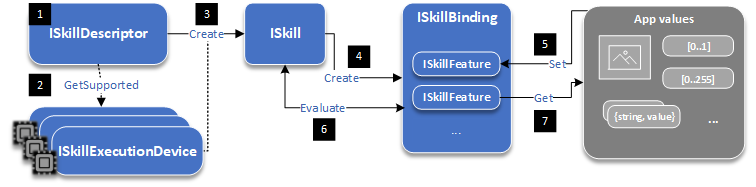

# Important API concepts

> **Note**
> Some information relates to pre-released product, which may be substantially modified before it's commercially released. Microsoft makes no warranties, express or implied, with respect to the information provided here.

The [Microsoft.AI.Skills.SkillInterface](./Microsoft.AI.Skills.SkillInterface.md) namespace provides a set of base interfaces to be extended by all *AI Skills for Windows* as well as classes and helper methods for skill implementers on Windows.

This API is meant to streamline the way *AI Skills for Windows* work and how developers interact with them. The goal is to abstract away the API specificities of each skill's logic and leverage instead a consistent developer intuition over a broad set of solutions and applications. It is also meant to leverage Windows primitives which eases interop with OS APIs. This constitutes a template to derive from that standardizes the developer flow and API interactions across all *AI Skills*.

Therefore all *AI Skills* are expected to implement at the very least the following interfaces:

 

| Name | Description |
|------|-------------|
| [ISkillDescriptor](./Microsoft.AI.Skills.SkillInterface.md#iskilldescriptor) | Provides information on the skill and exposes its requirements (input, output, version, etc). Acts as a factory for the [ISkill](./Microsoft.AI.Skills.SkillInterface.md#iskill). |
| [ISkillBinding](./Microsoft.AI.Skills.SkillInterface.md#iskillbinding) | Serves as an indexed container of [ISkillFeature](./Microsoft.AI.Skills.SkillInterface.md#iskillfeature). It acts as a conduit for input and output variables to be passed back and forth to the [ISkill](./Microsoft.AI.Skills.SkillInterface.md#iskill). It handles pre-processing and post-processing of the input/output data and simplifies their access. |
| [ISkill](./Microsoft.AI.Skills.SkillInterface.md#iskill) | Exposes the core logic of processing its input and forming its output via an [ISkillBinding](./Microsoft.AI.Skills.SkillInterface.md#iskillbinding). Acts as a factory for the [ISkillBinding](./Microsoft.AI.Skills.SkillInterface.md#iskillbinding). |

*AI Skills* are meant to optimally leverage the hardware capabilities (CPU, GPU, etc.) of each system they run on. These hardware acceleration devices are represented by deriving the [ISkillExecutionDevice](./Microsoft.AI.Skills.SkillInterface.md#iskillexecutiondevice) interface associated with a [SkillExecutionDeviceKind](./Microsoft.AI.Skills.SkillInterface.md#skillexecutiondevicekind). Therefore, [ISkillDescriptor](./Microsoft.AI.Skills.SkillInterface.md#iskilldescriptor) derivatives have to find, filter, and expose the set of [ISkillExecutionDevice](./Microsoft.AI.Skills.SkillInterface.md#iskillexecutiondevice) objects currently available on the host system that can execute the [ISkill](./Microsoft.AI.Skills.SkillInterface.md#iskill) logic.

This will allow the developer consuming the skill package to best chose how to tap into supported hardware resources at runtime on a user's system. There are some [ISkillExecutionDevice](./Microsoft.AI.Skills.SkillInterface.md#iskillexecutiondevice) derivative classes already defined and available for convenience ([SkillExecutionDeviceCPU](./Microsoft.AI.Skills.SkillInterface.md#skillexecutiondevicecpu) and [SkillExecutionDeviceDirectX](./Microsoft.AI.Skills.SkillInterface.md#skillexecutiondevicedirectx)).

In order to ensure that input and output variables are passed in the correct format to the skill, the [ISkillFeature](./Microsoft.AI.Skills.SkillInterface.md#iskillfeature) interface is defined. It is meant to encapsulate a value in a predefined format. This value is represented by a derivative of [ISkillFeatureValue](./Microsoft.AI.Skills.SkillInterface.md#iskillfeaturevalue), which has multiple common derivatives already defined and available for convenience ([ISkillFeatureTensorValue](./Microsoft.AI.Skills.SkillInterface.md#iskillfeaturetensorvalue), [SkillFeatureImageValue](./Microsoft.AI.Skills.SkillInterface.md#skillfeatureimagevalue), and [SkillFeatureMapValue](./Microsoft.AI.Skills.SkillInterface.md#skillfeaturemapvalue)).

Each [ISkillFeatureValue](./Microsoft.AI.Skills.SkillInterface.md#iskillfeaturevalue) derivative has a corresponding [ISkillFeatureDescriptor](./Microsoft.AI.Skills.SkillInterface.md#iskillfeaturedescriptor) derivative defined that describes the expected format supported by the skill ([ISkillFeatureTensorDescriptor](./Microsoft.AI.Skills.SkillInterface.md#iskillfeaturetensordescriptor), [ISkillFeatureImageDescriptor](./Microsoft.AI.Skills.SkillInterface.md#iskillfeatureimagedescriptor), and [ISkillFeatureMapDescriptor](./Microsoft.AI.Skills.SkillInterface.md#iskillfeaturemapdescriptor)). These [ISkillFeatureDescriptor](./Microsoft.AI.Skills.SkillInterface.md#iskillfeaturedescriptor) derivatives also act as factory objects for the [ISkillFeatureValue](./Microsoft.AI.Skills.SkillInterface.md#iskillfeaturevalue) objects they describe.

At instantiation time, if the primitive used to assign to [ISkillFeatureValue](./Microsoft.AI.Skills.SkillInterface.md#iskillfeaturevalue) does not match the description provided by its [ISkillFeatureDescriptor](./Microsoft.AI.Skills.SkillInterface.md#iskillfeaturedescriptor) counterpart, an automatic conversion specific to each type can occur seamlessly (for example, transcoding when binding an image in a different format than the one required, or cropping if the aspect ratio differs).

## API flow 

Since all *AI Skills* derive the same set of base interfaces from [Microsoft.AI.Skills.SkillInterface](./Microsoft.AI.Skills.SkillInterface.md), they all follow the same flow which usually boils down to the following operations:

1) Instantiate the [ISkillDescriptor](./Microsoft.AI.Skills.SkillInterface.md#iskilldescriptor) derivative.

2) Query the available execution devices using the instance from step 1 (using [ISkillDescriptor.GetSupportedExecutionDevicesAsync](./Microsoft.AI.Skills.SkillInterface.md#iskilldescriptor.getsupportedexecutiondevicesasync)) or skip and directly attempt step 3.

3) Instantiate the skill using the instance from step 1 and the desired execution device from step 2 (using [ISkillDescriptor.CreateSkillAsync(ISkillExecutionDevice)](./Microsoft.AI.Skills.SkillInterface.md#iskilldescriptor.createskillasync)) or the default one decided by the skill developer (using [ISkillDescriptor.CreateAsync()](./Microsoft.AI.Skills.SkillInterface.md#iskilldescriptor.createskillasync)).

4) Instantiate a skill binding object using the skill instance from step 3 (using [ISkill.CreateSkillBindingAsync](./Microsoft.AI.Skills.SkillInterface.md#iskill.createskillbindingasync)).

5) Retrieve your primitives ([VideoFrame](https://docs.microsoft.com/uwp/api/windows.media.videoframe), [IVectorView](https://docs.microsoft.com/uwp/api/windows.foundation.collections.ivectorview_t_), [IMapView](https://docs.microsoft.com/uwp/api/windows.foundation.collections.imapview_k_v_), etc.) from your application and bind them to your binding object from step 4 (by accessing the corresponding [ISkillFeature](./Microsoft.AI.Skills.SkillInterface.md#iskillfeature) indexed via its name and calling [ISkillFeature.SetFeatureValueAsync(Object)](./Microsoft.AI.Skills.SkillInterface.md#iskillfeature.setfeaturevalueasync)).

6) Run your skill over your binding object (by calling [ISkill.EvaluateAsync](./Microsoft.AI.Skills.SkillInterface.md#iskill.evaluateasync)).

7) Retrieve your output primitives from your binding object instantiated in step 4 (by accessing the corresponding [ISkillFeature](./Microsoft.AI.Skills.SkillInterface.md#iskillfeature) indexed via its name and calling the getter [ISkillFeature.FeatureValue](./Microsoft.AI.Skills.SkillInterface.md#iskillfeature.featurevalue)).

8) Rinse and repeat from step 5 using the same binding object and new primitives.

To see this in action, refer to the tutorial on ingesting [the object detector AI Skill from an app](../samples/ObjectDetector/Readme.md#using-the-objectdetector-skill).
