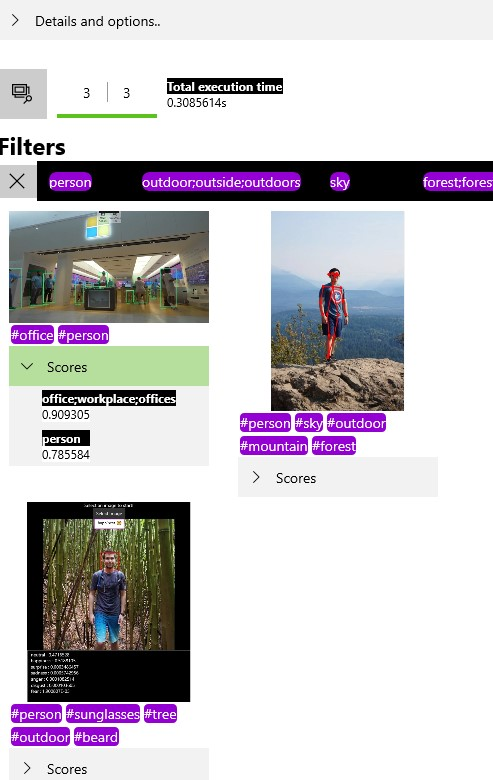

# Concept Tagger Windows Vision Skill samples

These samples will show how to use the Concept Tagger Vision Skill NuGet package to create apps that can identify and classify concepts in an image for scenarios such as picture indexation. 



<details>
<summary>This concept tagger skill can identify the following 256 concepts:</summary>
<p>

Column1
- airplane;aircraft;airliner;airplanes;plane;planes
- animal;animals
- aquarium;aquariums
- archery;archer;archers
- art
- art gallery
- aurora;aurora borealis;auroras;northern lights
- baby;babies;infant;infants;newborn;newborns
- backpack;backpacks;knapsack
- backyard;backyards;yard;yards
- baking;bake
- ball
- ballroom dance;ballroom dancing
- bar
- barcode;UPC
- barn;barns
- baseball
- basketball
- beach;beaches;beachfront;beachside;sandy beach;coast;shore
- beard;beards;facial hair
- beer;beers
- bicycle;bicycles
- bike;bikes
- bird;birds
- birthday;birthdays
- black
- black and white
- blue
- board game;board games
- boat;boats
- bonfire
- book;books
- bowling
- branch
- bread
- bridge;bridges
- brown
- building;buildings
- bus;buses
- butterfly;butterflies
- cable car;cable cars
- cake;cakes
- camera;cameras
- camp;camps;camping
- canoe;canoes
- canyon;canyons
- car;cars
- casino;casinos;gambling
- castle;castles
- cat;cats
- cave;caves;cavern;caverns
- celebration;celebrations
- cellphone;cellphones;mobile phone
- cheerleading;cheerleader;cheerleaders
- chess
- chocolate;chocolates
- Christmas decor
- Christmas;Xmas
- cliff;cliffs
- climb;climbing;climbs
- clock
- clown;clowns
- collage;collages
- computer;computers
- concert;concerts
- cook;cooked;cooking;cooks
- cricket
- crowd;crowds;people;crowded
- cruise ship;cruise liner;cruise ships;cruiseship;cruiseships
- dance;dancers;dances;dancing
- deck;decks;patio;patios
- desert;deserts
- dessert;desserts
- Diwali;Deewali;Deepawali
- document;documents
- dog;dogs;puppy
- draw;drawing;paint;painting
- dress;attire;dresses
- drink;drinks
- duck;ducks
- dune
- easter
- eat;eats;ate;eating
- factory;factories
- fair
- farm;farms
- ferris wheel
- field hockey
- fire department
- fire;blaze;fires
- fireplace;fireplaces;hearth;wood stove;woodstove
- fireworks;firecrackers;firework
- fish;marine life
- flower;floral;flowers
- fog;foggy;mist
- food
- football
- forest;forests
- fruit;fruits
- glacier;glaciers
- glass
- golf;golfing
- graduation
- green
- grey
- group
- guitar;guitars
- gymnast;gymnastics;gymnasts
- halloween
- hanukkah;Hannukah;Hanukah;Hanukka;Chanukah
- helicopter;helicopters
- hike;hikes;hiking
- hockey
- holiday;holidays
- home
- horse;horses
- hot tub;jacuzzi;hot tubs
- hotel;hotels
- house;houses
- hummingbird;hummingbirds
- ice
- ice hockey
- ice skating;skating
- icicle;icicles
- identification;identifications;ID
- jungle
- kayak;kayaking;kayaks
- kid;children;child;kids
- kiss;kisses;kissing
- kitchen;kitchens
- kitten
- lake;lakes;pond
- landmark
- lego;block;blocks
- lighthouse;lighthouses;beacon
- lightning
- martial art
- mask;masks
- meme
- menu;menus
- miniature golf;mini golf
- monument;monuments
- moon;lunar
- motorcycle;motorbike;motorcycles
- mountain range
- mountain;mountains
- museum;museums
- music
- musical theatre
- nature
- nebula
- newspaper;newspapers
- night;nights;dark;darkness
- office;workplace;offices
- orange
- outdoor;outside;outdoors
- palace;palaces;mansion;mansions
- paper;papers
- park;parks;recreation
- parking;parked;parking lot
- pen;pens
- penguin;penguins
- person
- pet;pets
- phone;phones
- piano
- picnic;picnics
- pier;piers;dock;docks;wharf
- pink
- pizza;pizzas
- playground;playgrounds
- pool;pools
- portrait;portraits
- poster;flyer;posters;flyers
- presentation;presenting;slide;slides
- prom;proms
- purple
- race track;race tracks;racetrack;racetracks;raceway;track
- rainbow
- ranch;ranches
- receipt;receipts;bill
- red
- reef;coral reef;reefs
- restaurant;eatery;restaurants
- rock climbing
- rowing;rowers
- run;running;ran;jogging;sprint;jog
- safari;safaris
- sail
- sailboat;sailboats;sailing
- saint Patrick's Day
- screenshot;screencap;screengrab;screenshots
- scuba diving;scuba;scuba dive;diving
- selfies;selfie
- ship;ships
- silhouette;silhouettes;shadow;shadows
- skateboard;skateboarding;skateboards;skate;skater
- ski;skis;skier;skiers;skiing
- sky
- skyline;cityscape;skylines
- skyscraper;skyscrapers
- smile;smiling;smiles;grin;grins;grinning
- snow;snows
- soccer
- softball
- sport;sports
- stadium;stadiums
- stained glass
- star;stars
- statue;statues
- storm;storms
- street;streets;road;roads
- stuffed toy
- sunglasses
- sunset
- surf;surfer;surfers;surfing
- swamp;swamps
- swim;swam;swimmers;swimming;swims
- swimming pool;swimming pools
- table;tables;desk;desks
- teal
- telephone
- tennis
- thanksgiving
- theatre;theatres;theater;theaters
- tower;towers
- toy;toys
- tractor;tractors
- train;trains
- tree;trees
- truck;trucks
- trunk
- tubing
- turtle;turtles;tortoise;tortoises
- umbrella
- vacation
- valentine's Day;valentine;valentines
- vehicle;vehicles;transit
- vineyard;vineyards;winery
- volleyball;volley ball
- wakeboard;wakeboarders;wakeboarding
- water
- water park
- waterfall;waterfalls
- waterski
- wedding dress
- wedding reception
- wedding;nuptials;weddings
- white
- whiteboard;whiteboards
- wine;wines
- winter
- wrestle;wrestled;wrestling
- yacht;yachts
- yellow
- zoo
</p>
</details>

Follow these sample links:
- [C# UWP sample app](./cs/ConceptTaggerSample_UWP)
- [Win32 C++/Winrt Desktop console app](./cpp/ConceptTaggerSample_Desktop)
- [.Net Core 3.0 C# console app](./cs/ConceptTaggerSample_NetCore3)

## Build samples
- refer to the [sample guidelines](../README.md)
- make sure the Microsoft.AI.Skills.Vision.ConceptTagger and Microsoft.AI.Skills.SkillInterface NuGet packages are installed on your app projects

## Related topics

- [Microsoft.AI.Skills.SkillInterface API document](../../doc/Microsoft.AI.Skills.SkillInterface.md)
- [Microsoft.AI.Skills.Vision.ConceptTagger API document](../../doc/Microsoft.AI.Skills.Vision.ConceptTagger.md)
- [Creating a custom Windows Vision Skill](../SentimentAnalyzerCustomSkill)

## Run the UWP sample

The app allows you to select multiple image files and process them with the skill. Use the buttons at the top of the window to select one or more .jpg or .png image files. Click the "Details and options" expander to view more details about the ConceptTagger skill as well as configure options such as the `ISkillExecutionDevice` to run the skill on.

Additionally, the app shows you how you can instantiate multiple `ISkill`and `ISkillBinding` and use them in parallel to distribute the computation across the available computing cores of a CPU. The app reads the amount of CPU cores available from the [SkillExecutionDeviceCPU](../../doc/Microsoft.AI.Skills.Vision.ConceptTagger.md#SkillExecutionDeviceCPU) returned from [ISkillDescriptor.GetSupportedExecutionDevicesAsync()](../../doc/Microsoft.AI.Skills.Vision.ConceptTagger.md#ISkillDescriptor.GetSupportedExecutionDevicesAsync)

### Using the ConceptTagger skill

As with all Vision Skills, the Concept Tagger skill is composed of an `ISkillDescriptor` (which holds general skill information), the `ISkill` instance (which is bound to a specific `ISkillExecutionDevice`), and the skill's `ISkillBinding` (which holds skill inputs, outputs, and any state information). You can instantiate your Concept Tagger skill as follows.

```csharp
ConceptTaggerDescriptor descriptor = new ConceptTaggerDescriptor();
ConceptTaggerkill skill = await descriptor.CreateSkillAsync() as ConceptTaggerSkill; // If you don't specify an ISkillExecutionDevice, a default will be automatically selected
ConceptTaggerBinding binding = await skill.CreateSkillBindingAsync() as ConceptTaggerBinding;
```

The Concept Tagger skill does not define any additional inputs, so using the skill is as simple as:

```csharp
await binding.SetInputImageAsync(frame);  // frame is a Windows.Media.VideoFrame
await skill.EvaluateAsync(binding);
// Results are saved to binding instance
```

You may manually interrogate the binding to find your output, but it's easiest to use the convenience field(s) defined. In this case, `ConceptTaggerBinding` has a `GetTopXTagsAboveThreshold` method, which return a `IReadOnlyList<ConceptTagScore>` of at most the specifid amount of concepts that scored above the specified confidence threshold. `ConceptTagScore` is a struct containing two string members: a concept name and a concept score.

```csharp
IReadOnlyList<ConceptTagScore> tags = binding.GetTopXTagsAboveThreshold(5, 0.7f);
foreach (ConceptTagScore tag in tags)
{
    string resultMessage = $"{tag.Name} : {tag.Score}";
}
```

The concept tagger can score 256 types of tags defined in the valid keys of the output feature descriptor:
```csharp
ConceptTaggerDescriptor descriptor = new ConceptTaggerDescriptor();
ISkillFeatureMapDescriptor mapDesc = descriptor.OutputFeatureDescriptors.First() as ISkillFeatureMapDescriptor;

// Create a string containing all tags that this skil can score
string validKeys = "";
foreach (var validKey in mapDesc.ValidKeys)
{
    validKeys += $"{validKey}\n";
}
```

### Sample app code walkthrough

The core skill initialization logic is in the `UISkillExecutionDevices_SelectionChanged` method:

```csharp
ISkillExecutionDevice device = m_availableDevices[selectedIndex];

// initialize skill instances
for (int i = 0; i < m_concurrentSkillCount; i++)
{
    skill = await m_skillDescriptor.CreateSkillAsync(device) as ConceptTaggerSkill;
    m_skillQueue.Enqueue(skill);
}
// initialize binding instances
for (int i = 0; i < m_concurrentBindingCount; i++)
{
    m_bindingQueue.Enqueue(await skill.CreateSkillBindingAsync() as ConceptTaggerBinding);
}
```

The method uses both overloads of `ISkillDescriptor.CreateSkillAsync` to show how they can be used: either let the skill select a default device, or specify the device you would like it to use.

The core skill evaluation logic can be found in `UIButtonFilePick_Click` and `EvaluateBinding`:

```csharp
private async void UIButtonFilePick_Click(object sender, RoutedEventArgs e)
{
    ...
    // Load the VideoFrame from the image file
    var frame = await LoadVideoFrameFromFileAsync(file);

    // Bind input image
    await binding.SetInputImageAsync(frame);
    ...
}

private async Task EvaluateBinding(ConceptTaggerBinding binding, ResultItemUserControl resultItem)
{
    ...
    // Evaluate binding
    await skill.EvaluateAsync(binding);
    ...
}
```

Overall application initialization is performed in `Page_Loaded`, which triggers the previously mentioned `UISkillExecutionDevices_SelectionChanged` method as well as some other UI initialization. 

Most of the work is performed by the `UIButtonFilePick_Click` event handler. The handler uses locking to ensure that only the pre-determined amount of simultaneous threads are launched to bind the input frames and schedule skill execution. These tasks are launched as "fire and forget" (not awaited), relying on the locking behavior for synchronization.

The sample app also uses several helper classes. These may be safely treated as black boxes, but a quick overview is:

- **SkillHelperMethods** - Class that exposes several facilities to handle skill information
- **ResultItemUserControl** - Helper class to render image and results correctly in the UI


