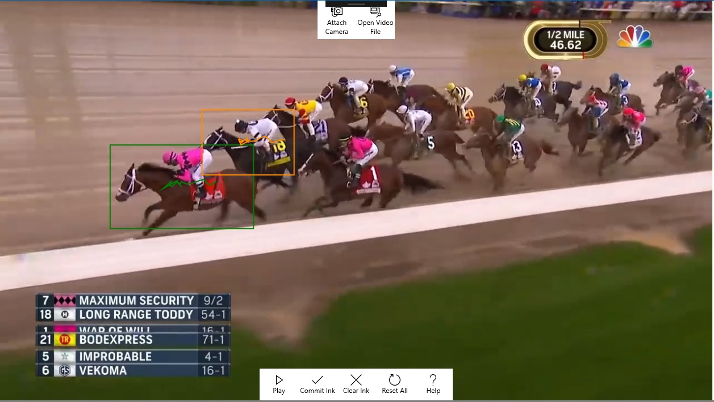

# Object Tracker AI Skill for Windows samples

These samples will show how to use the Object Tracker AI Skill for Windows NuGet package to create apps that can track objects in a video feed



Follow these sample links:
- [C# UWP sample app](./cs/ObjectTrackerSample_UWP)

## Build samples
- refer to the [sample guidelines](../README.md)
- make sure the Microsoft.AI.Skills.Vision.ObjectTracker and Microsoft.AI.Skills.SkillInterface NuGet packages are installed on your app projects

## Related topics

- [Microsoft.AI.Skills.SkillInterface API document](../../doc/Microsoft.AI.Skills.SkillInterface.md)
- [Microsoft.AI.Skills.Vision.ObjectTracker API document](../../doc/Microsoft.AI.Skills.Vision.ObjectTracker.md)
- [Creating a custom Windows AI Skill for Windows](../SentimentAnalyzerCustomSkill)

## Run the UWP sample

The app supports two types of media inputs: webcam and video file. Use the buttons at the top of the window to select the media source you would like to use. Click the "Details and options" expander to view more details about the ObjectTracker skill as well as configure options.

### Using the ObjectTracker skill

As with all AI Skills for Windows, the Object Tracker skill is composed of an `ISkillDescriptor` (which holds general skill information), the `ISkill` instance (which is bound to a specific `ISkillExecutionDevice`), and the skill's `ISkillBinding` (which holds skill inputs, outputs, and any state information). You can instantiate your Object Tracker skill as follows.

```csharp
ObjectTrackerDescriptor descriptor = new ObjectTrackerDescriptor();
ObjectTrackerSkill skill = await descriptor.CreateSkillAsync() as ObjectTrackerSkill; // If you don't specify an ISkillExecutionDevice, a default will be automatically selected
ObjectTrackerBinding binding = await skill.CreateSkillBindingAsync() as ObjectTrackerBinding;
```

The tracker must be initialized with the object to track before it can be used. This is done using the `ObjectTrackerSkill.InitializeTrackerAsync` method, whose results are stored in the provided `ObjectTrackerBinding`

```csharp
// frame is a Windows.Media.VideoFrame
// initialRect is a Windows.Foundation.Rect
await skill.InitializeTrackerAsync(binding, frame, initialRect);
```

> **IMPORTANT!**  
> The `ObjectTrackerBinding` **must** be initialized using `ObjectTrackerSkill.InitializeTrackerAsync` before attempting evaluation! Evaluating an uninitialized tracker binding is undefined and will most likely fail with an exception.

Once the tracker (binding) has been initialized, the tracker can be updated against each new frame as follows:

```csharp
await binding.SetInputImageAsync(frame);  // frame is a Windows.Media.VideoFrame
await skill.EvaluateAsync(binding);
// Results are saved to binding object
```

Note that there is an optional input which enables/disables expanding search area in the event of tracking failure (see [ObjectTracker's API documentation](../../doc/Microsoft.AI.Skills.Vision.ObjectTracker.md#SetEnableExpandingSearchAreaAsync) for more details). The input is on a per-binding basis and can be set as:

```csharp
await binding.SetEnableExpandingSearchAreaAsync(enableExpandingSearchArea); // enableExpandingSearchArea is a bool
```

To get the tracker results, you may manually interrogate the binding to find your output, but it's easiest to use the convenience field(s) defined. In this case, `ObjectTrackerBinding` has a `BoundingRect` field which contains the tracker's latest bounding `Rect` and a `Succeeded` field which is a boolean marking latest evaluation status.

```csharp
Windows.Foundation.Rect boundingRect = binding.BoundingRect;
bool trackerSucceeded = binding.Succeeded;
```

### Sample app code walkthrough

The core skill initialization logic is in `InitializeSkillAsync`:

```csharp
private async Task InitializeSkillAsync(ISkillExecutionDevice executionDevice = null)
{
    m_descriptor = new ObjectTrackerDescriptor();
    m_availableExecutionDevices = await m_descriptor.GetSupportedExecutionDevicesAsync();
    if (m_availableExecutionDevices.Count == 0)
    {
        NotifyUser("No execution devices available, this skill cannot run on this device", NotifyType.ErrorMessage);
        return; // Abort
    }

    // Either create skill using provided execution device or let skill create with default device if none provided
    if (executionDevice != null)
    {
        m_skill = await m_descriptor.CreateSkillAsync(executionDevice) as ObjectTrackerSkill;
    }
    else
    {
        m_skill = await m_descriptor.CreateSkillAsync() as ObjectTrackerSkill;
    }

    m_bindings = new List<ObjectTrackerBinding>();
    m_trackerHistory = new List<List<TrackerResult>>();
}
```

Note that we have a `List<ObjectTrackerBinding>` instead of a single binding. This is an example of how a single `ObjectTrackerSkill` instance can be used to track multiple objects, with each `ObjectTrackerBinding` corresponding to a single tracked object.

The core skill evaluation logic, including initialization logic for new trackers, is in `RunSkillAsync`:

```csharp
private async Task RunSkillAsync(VideoFrame frame)
{
    /* ...snip... */
    // Update existing trackers
    for (int i = 0; i < m_bindings.Count; i++)
    {
        await m_bindings[i].SetInputImageAsync(frame);
        m_skillEvalStopWatch.Restart();
        await m_skill.EvaluateAsync(m_bindings[i]);
        m_skillEvalStopWatch.Stop();
        evalTicks += m_skillEvalStopWatch.ElapsedTicks;

        // Add result to history
        m_trackerHistory[i].Add(
            new TrackerResult()
            {
                boundingRect = m_bindings[i].BoundingRect,
                succeeded = m_bindings[i].Succeeded
            }
        );
    }
    /* ...snip... */
    // Initialize any new trackers
    for (int i = 0; i < m_drawnRects.Count; i++)
    {
        ObjectTrackerBinding binding = await m_skill.CreateSkillBindingAsync() as ObjectTrackerBinding;
        await m_skill.InitializeTrackerAsync(binding, frame, m_drawnRects[i]);
        m_bindings.Add(binding);

        // Add corresponding tracker history
        m_trackerHistory.Add(
            new List<TrackerResult> {
                        new TrackerResult()
                        {
                            boundingRect = binding.BoundingRect,
                            succeeded = true
                        }
            }
        );
    }
    m_drawnRects.Clear();
    /* ...snip... */
}
```

Overall application initialization is performed in the `MainPage` constructor and in `MainPage.OnNavigatedTo`, which calls the previously mentioned `InitializeSkillAsync` method among others.

Most of the work is performed by the `FrameSource_FrameAvailable` event handler. The handler uses locking to ensure only one skill evaluation happens at a time, dropping incoming frames as necessary. `RunSkillAsync` is called from within this event handler.

The sample app also uses several helper classes. These may be safely treated as black boxes, but a quick overview is:

- **ObjectTrackRenderer** - Used for rendering object tracker results to the `Canvas` as bounding boxes and history paths
- **IFrameSource** - Provides a common interface to wrap various media source types with
- **FrameReaderFrameSource** - Wrapper for [MediaFrameReader](https://docs.microsoft.com/en-us/uwp/api/Windows.Media.Capture.Frames.MediaFrameReader) for camera streaming
- **MediaPlayerFrameSource** - Wrapper for [MediaPlayer](https://docs.microsoft.com/en-us/uwp/api/Windows.Media.Playback.MediaPlayer) for video file playback
