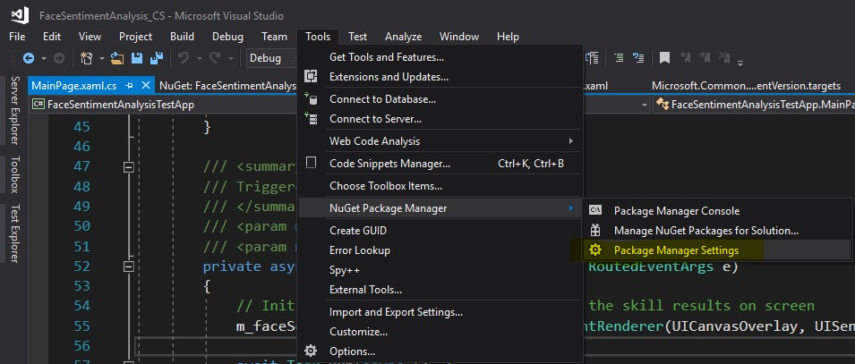
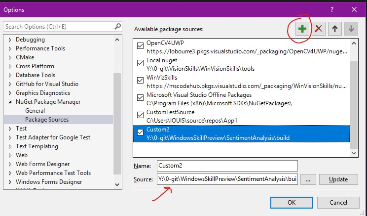
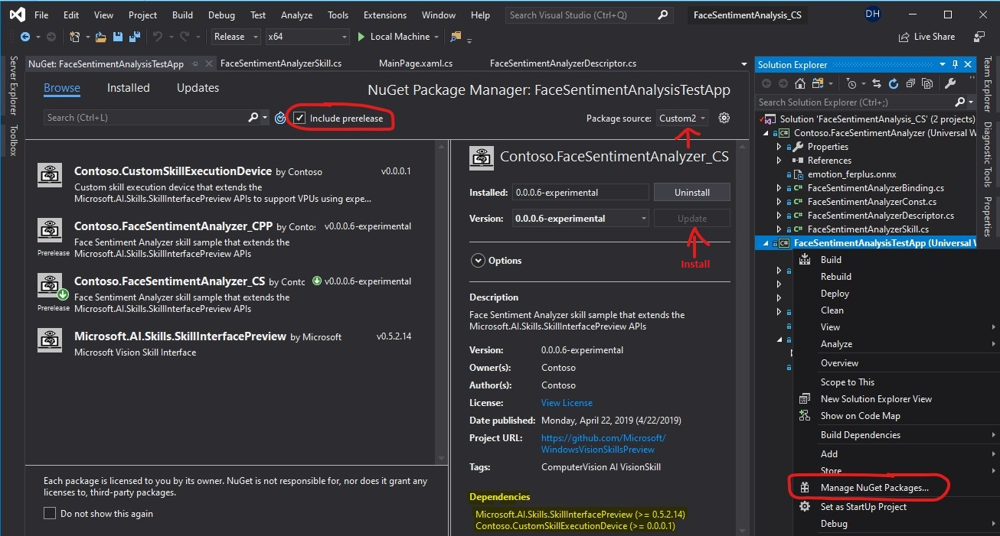

# Sentiment Analyzer AI Skill sample

Provides an end-to-end sample to show how to write an AI Skill for Windows by extending the [Microsoft.AI.Skills.SkillInterface](../../doc/Microsoft.AI.Skills.SkillInterface.md) base API.
This skill's implementation leverages the Windows built-in `FaceDetector` and `Windows.AI` APIs along a Machine Learning model in ONNX format to identify a face in an image, segment the portion of the image where the face is, feed it to the ml model and infer its sentiment.
This sample also contains scripts to package the skill's Windows Runtime Component and its assets to a NuGet package (.nupkg). It also provides sample applications written in C++ and C# targetting UWP, Win32 Desktop and .NetCore 3.0 Desktop that ingest this NuGet package and execute the skill against images.

## Scenario
A developer wants to expose a functionality to his/her users that infers the sentiments of persons from an image like so:


In order to hide the complexity of the implementation and to ease the development of that functionality, the developer opts to leverage the SkillInterface APIs, extending the main classes to leverage the consistent API paradigm it introduces. This allows the developer to expose the compatible execution devices and deal internally with the complexity of the execution pipeline without imposing it to the consumer. A simplified view of a 2-step pipeline may look like this: 
 
 

The initialization of this pipeline is not pictured here but each step needs its own initialization routine which also adds complexity. What the consumer really cares about is feeding input, triggering the execution of the processing and retrieving the expected output: 
 
 

However, some consumers may also want to tweak and optimize part of that pipeline to avoid for example an image conversion step by feeding the correct image format in the first place or ensure execution of this functionality is less power hungry by selecting a specific execution device to run on. The skill interface API allows a developer to expose these parameters but still encapsulate complexity of a solution. 

Specifically, this sample shows how to:

1. **Create and implement a skill descriptor class** inherited from ISkillDescriptor that provide information on the skill, provides a list of supported execution devices (CPU, GPU) and acts as a factory object for the skill.
2. **Create and implement a skill class** inherited from ISkill that executes the skill logic and produces output given a set of input, and acts as a factory object for the skill binding.
3. **Create and implement a skill binding class** inherited from ISkillBinding that contains input and output variables as well as expose adapter to ease usage by developers.
4. **Obfuscate files as pre-build step and deobfuscate files at runtime** to deter your skill consumers from tempering or accessing your resource files. Note that this part is shown only in this C++/WinRT version of the skill to keep the other C# version simpler. Obfuscation is handled as a pre-build step using a dedicated compiled tool (Obfuscator.exe) and deobfuscation is exposed via a simple helper Windows Runtime Component ingested by the skill (DeobfuscationHelper).
5. **Create a NuGet package** that is dependent on the Microsoft.AI.Skills.SkillInterface NuGet package that encapsulates a Windows Runtime Component along its assets so that an app can ingest it. This NuGet package also links to a license and triggers a request for its approval before ingestion.
6. **Create a set of apps that ingest a custom AI Skill for Windows** to execute sentiment analysis againt images from a camera by binding VideoFrame instances and displaying results by retrieving them from the binding.
    1. **C# UWP** app with a UI
    2. **C++/WinRT** Desktop console app
    3. **C++ WRL** Desktop console app
    4. **.NetCore 3.0 C#** Desktop console app

## System requirements

- refer to the [sample guidelines](../README.md)

## Build the samples
### 1. Build and package the sample skills

1. If you download the samples ZIP, be sure to unzip the entire archive, not just the folder with the sample you want to build.

2. Open a powershell command line and navigate to the *<root>/build/* folder.

3. To build and package the **C# version** of the sample skill:
    1. Run the included powershell script named *BuildSentimentAnalyzer_CS.ps1* which will build the C# version of the FaceDetection AI Skill for all architectures (x64, x86, ARM64, ARM)
    2. Once the sample is built, to generate a NuGet package from it, you can run the included powershell script named *PackageSentimentAnalyzer_CS.ps1* or run manualy from a cmd window opened in this folder the following:
        ````
        .\nuget.exe pack Contoso.FaceSentimentAnalyzer_CS.nuspec
        ````
        You should see a *Contoso.FaceSentimentAnalyzer_CS\*.nupkg* NuGet package file generated.

4. To build and package the **C++/WinRT version** of the skill:
    1. Run the included powershell script named *BuildSentimentAnalyzer_CPP.ps1* which will build the C++ version of the FaceDetection AI Skill for all architectures (x64, x86, ARM64, ARM) 
        <a name="ManifestGeneration"></a>
        - This version of the skill will run a script as a post-build step that generates a [manifest file](https://docs.microsoft.com/en-us/windows/desktop/sbscs/manifests) (.manifest). This enables a mechanism that provides interoperability with **Win32** and **.NetCore 3.0** apps by activating COM components exposed in our skill Windows Runtime Component we just built.
    2. Once the sample is built, to generate a NuGet package from it, you can run the included powershell script named *PackageSentimentAnalyzer_CPP.ps1*. 
        ````
        .\nuget.exe pack Contoso.FaceSentimentAnalyzer_CPP.nuspec
        ````
        You should see a *FaceSentimentAnalyzer_CPP\*.nupkg* NuGet package file generated.

### 2. Build and run the sample apps

To run the test app and visualize the sample code for the skill:
- **For the C# sample** that contains a C# UWP app, open the solution file located at *cs\FaceSentimentAnalysis_CS.sln*
- **For the C++/WinRT sample**, open the solution file located at *cpp\FaceSentimentAnalysis_Cpp.sln*
    >**Important to note:** For the C++/WinRT and C++ WRL console applications, there are pre-build and post-build steps that leverage a set of powershell scripts included in *<root>/cpp/Scripts*. These scripts can be reused in your projects when you write this kind of application that leverages AI Skills for Windows.
         - The pre-build script generate header files from the skill's Windows Runtime Component metadata included in the NuGet package (.winmd).
         - The post-build script copies dependency binaries to the application's executable location.

    >**Important to note:** the file named *app.manifest* included in these two application projects must reference the dependent assemblies present in the NuGet packages ingested. This leverages the work done in the [previous step 4.1 in the previous section](#ManifestGeneration) when building your skill.

In order for local NuGet packages to be available to your app project, you need to add a local NuGet repository pointing to where you built the skill NuGet package and where the base API package resides (i.e. in *./build/*). Follow the below steps to achieve this: <a name="PrivateNuGetFeed"></a>
1. In Visual Studio, go to *Tools* \> *NuGet Package Manager* \> *Package Manager Settings*


2. Click on the *+* sign to add a new NuGet source and make sure the value of the source is the path to the folder where the *.nupkg* files are (i.e. in *./build/*)


3. From your test app project, make sure you install the skill NuGet package by right-clicking on your project \> *Manage NuGet Packages*, then make sure the *Package Source* points to your custom NuGet source, then click *Install*

    >**Important to note:** make sure you check the box named "*include prerelease*" to see the preview versions of NuGet packages such as the version of the *Microsoft.AI.Skills.SkillInterface* leveraged by the FaceDetection AI Skill this app ingests.

## Related topics
**Reference**
- [Using the Face Detection effect](https://docs.microsoft.com/en-us/uwp/api/Windows.Media.FaceAnalysis.FaceDetector)
- [Using Windows ML](https://docs.microsoft.com/en-us/windows/ai/)
- [Using CryptographicEngine to obfuscate and deobfuscate files at runtime](https://docs.microsoft.com/en-us/uwp/api/windows.security.cryptography.core.symmetrickeyalgorithmprovider)
- [Acquiring the sentiment analysis ONNX model](https://github.com/onnx/models/tree/master/vision/body_analysis/emotion_ferplus)
- [C++/Winrt reference documentation](https://docs.microsoft.com/en-us/windows/uwp/cpp-and-winrt-apis/)
- [MIDL 3.0 syntax reference guide for authoring .idl files](https://docs.microsoft.com/en-us/uwp/midl-3/intro)
- [Reg-Free WinRT component activation for Win32 apps and linking dependencies](https://blogs.windows.com/buildingapps/2019/04/30/enhancing-non-packaged-desktop-apps-using-windows-runtime-components)

# Contributing

This project welcomes contributions and suggestions.  Most contributions require you to agree to a
Contributor License Agreement (CLA) declaring that you have the right to, and actually do, grant us
the rights to use your contribution. For details, visit https://cla.microsoft.com.

When you submit a pull request, a CLA-bot will automatically determine whether you need to provide
a CLA and decorate the PR appropriately (e.g., label, comment). Simply follow the instructions
provided by the bot. You will only need to do this once across all repos using our CLA.

This project has adopted the [Microsoft Open Source Code of Conduct](https://opensource.microsoft.com/codeofconduct/).
For more information see the [Code of Conduct FAQ](https://opensource.microsoft.com/codeofconduct/faq/) or
contact [opencode@microsoft.com](mailto:opencode@microsoft.com) with any additional questions or comments.
