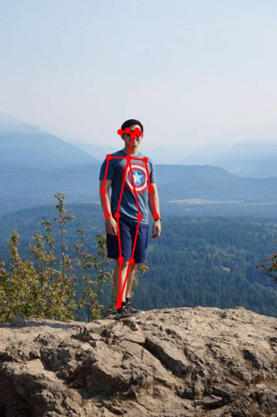

# Skeletal Detector Windows Vision Skill samples

These samples will show how to use the Skeletal Detector Vision Skill NuGet package to create apps that can detect and identify individuals in a video or image, and the poses of their bodies. 



Follow these sample links:
- [C# UWP sample app](./cs/SkeletalDetectorSample_UWP)
- [Win32 C++/Winrt Desktop console app](./cpp/SkeletalDetectorSample_Desktop)
- [.Net Core 3.0 C# console app](./cs/SkeletalDetectorSample_NetCore3)

## Build samples
- refer to the [sample guidelines](../README.md)
- make sure the Microsoft.AI.Skills.Vision.SkeletalDetector and Microsoft.AI.Skills.SkillInterface NuGet packages are installed on your app projects

## Related topics

- [Microsoft.AI.Skills.SkillInterface API document](../../doc/Microsoft.AI.Skills.SkillInterface.md)
- [Microsoft.AI.Skills.Vision.SkeletalDetector API document](../../doc/Microsoft.AI.Skills.Vision.SkeletalDetector.md)
- [Creating a custom Windows Vision Skill](../SentimentAnalyzerCustomSkill)

## Run the UWP sample

The app supports three types of media inputs: webcam, video file and image file. Use the buttons at the top of the window to select the media source you would like to use. Click the "Details and options" expander to view more details about the SkeletalDetector skill as well as configure options such as the `ISkillExecutionDevice` to run the skill on.

### Using the SkeletalDetector skill

As with all Vision Skills, the Skeletal Detector skill is composed of an `ISkillDescriptor` (which holds general skill information), the `ISkill` instance (which is bound to a specific `ISkillExecutionDevice`), and the skill's `ISkillBinding` (which holds skill inputs, outputs, and any state information). You can instantiate your Skeletal Detector skill as follows.

```csharp
SkeletalDetectorDescriptor descriptor = new SkeletalDetectorDescriptor();
SkeletalDetectorkill skill = await descriptor.CreateSkillAsync() as SkeletalDetectorSkill; // If you don't specify an ISkillExecutionDevice, a default will be automatically selected
SkeletalDetectorBinding binding = await skill.CreateSkillBindingAsync() as SkeletalDetectorBinding;
```

The Skeletal Detector skill does not define any additional inputs, so using the skill is as simple as:

```csharp
await binding.SetInputImageAsync(frame);  // frame is a Windows.Media.VideoFrame
await skill.EvaluateAsync(binding);
// Results are saved to binding instance
```

You may manually interrogate the binding to find your output, but it's easiest to use the convenience field(s) defined. In this case, `SkeletalDetectorBinding` has a `Bodies` field, which is of type `IReadOnlyList<SkeletalDetectorResult>`. `SkeletalDetectorResult` is a struct containing a list of `Limbs` which is another struct that defines `Joints` start and endnormalized coordinates as well as a label.

```csharp
IReadOnlyList<SkeletalDetectorResult> bodies = binding.Bodies;
foreach (SkeletalDetectorResult body in bodies)
{
    foreach (Limb limb in body.Limbs)
    {
        Joint joint1 = limb.Joint1;
        Joint joint2 = limb.Joint2;
        string resultMessage = $"This limb starts from {joint1.Label} at [{joint1.X}, {joint1.Y}] and ends with {joint1.Label} at [{joint2.X}, {joint2.Y}]";
    }
}
```

The skeletal detector supports 19 types of joints, or `JointLabel`s.

### Sample app code walkthrough

The core skill initialization logic is in the `InitializeSkeletalDetectorAsync` method:

```csharp
private async Task InitializeSkeletalDetectorAsync(ISkillExecutionDevice device = null)
{
    if (device != null)
    {
        m_skill = await m_descriptor.CreateSkillAsync(device) as SkeletalDetectorSkill;
    }
    else
    {
        m_skill = await m_descriptor.CreateSkillAsync() as SkeletalDetectorSkill;
    }
    m_binding = await m_skill.CreateSkillBindingAsync() as SkeletalDetectorBinding;
}
```

The method uses both overloads of `ISkillDescriptor.CreateSkillAsync` to show how they can be used: either let the skill select a default device, or specify the device you would like it to use.

The core skill evaluation logic can be found in `RunSkillAsync` and `DisplayFrameAndResultAsync`:

```csharp
private async Task RunSkillAsync(VideoFrame frame)
{
    // Update bound input image
    await m_binding.SetInputImageAsync(frame);

     // Run the skill against the binding
    await m_skill.EvaluateAsync(m_binding);
}

private async Task DisplayFrameAndResultAsync(VideoFrame frame)
{
    ...
    m_bodyRenderer.Update(m_binding.Bodies);
    ...
}
```

Overall application initialization is performed in `Page_Loaded`, which calls the previously mentioned `InitializeSkeletalDetectorAsync` method as well as some other UI initialization. The `UpdateSkillUIAsync` method that is also called may appear to be non-trivial, but in fact it simply populates the fields in the "Details and options..." expander UI. It should be noted that the `ISkillDescriptor` is created directly here:

```csharp
// ...
m_descriptor = new SkeletalDetectorDescriptor();
m_availableExecutionDevices = await m_descriptor.GetSupportedExecutionDevicesAsync();

await InitializeSkeletalDetectorAsync();
// ...
```

This is since we may call `InitializeSkeletalDetectorAsync` multiple times, such as whenever we switch `ISkillExecutionDevice`s. However, we only need to create the `SkeletalDetectorDescriptor` once.

Most of the work is performed by the `FrameSource_FrameAvailable` event handler. The handler uses locking to ensure only one skill evaluation happens at a time, dropping incoming frames as necessary. The handler launches a `Task` which performs the actual skill evaluation and result displaying and exits without `await`ing the task, relying on the locking behavior for synchronization.

The sample app also uses several helper classes. These may be safely treated as black boxes, but a quick overview is:

- **BodyBoxRenderer** - Used for rendering skeletal detections to the `Canvas` as bounding boxes and labels
- **IFrameSource** - Provides a common interface to wrap various media source types with
- **FrameReaderFrameSource** - Wrapper for [MediaFrameReader](https://docs.microsoft.com/en-us/uwp/api/Windows.Media.Capture.Frames.MediaFrameReader) for camera streaming
- **MediaPlayerFrameSource** - Wrapper for [MediaPlayer](https://docs.microsoft.com/en-us/uwp/api/Windows.Media.Playback.MediaPlayer) for video file playback


